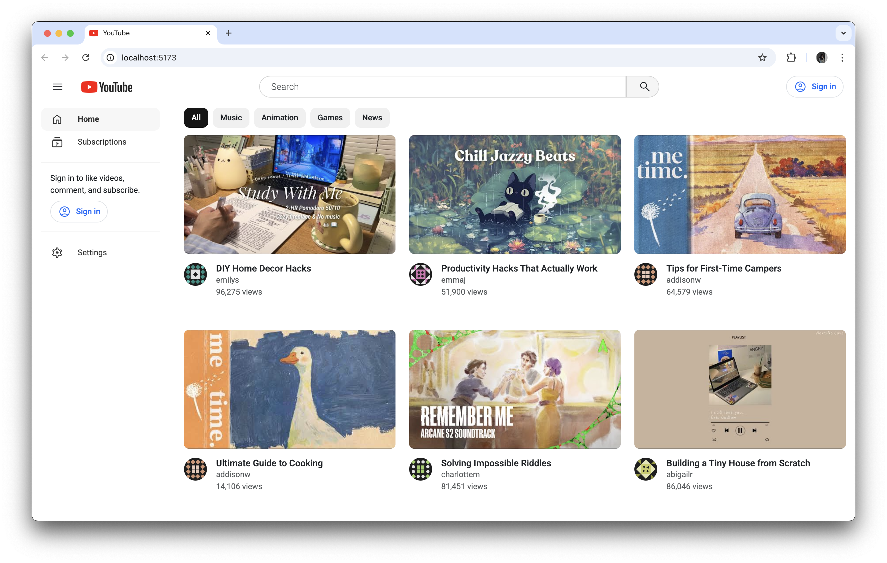
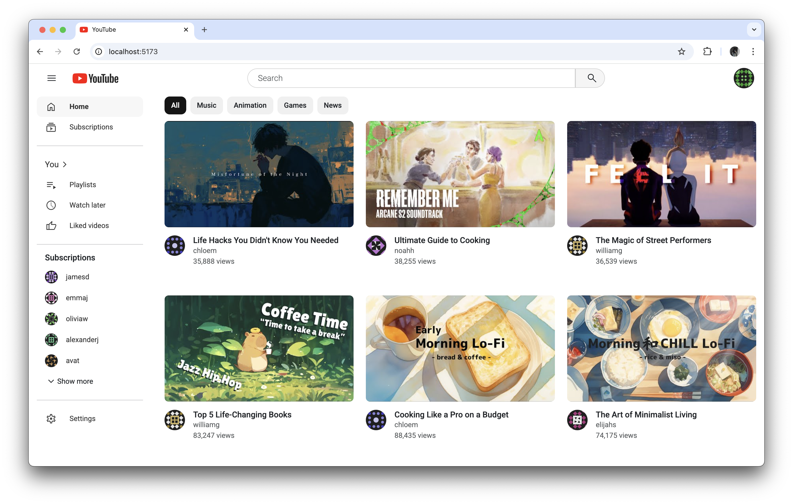
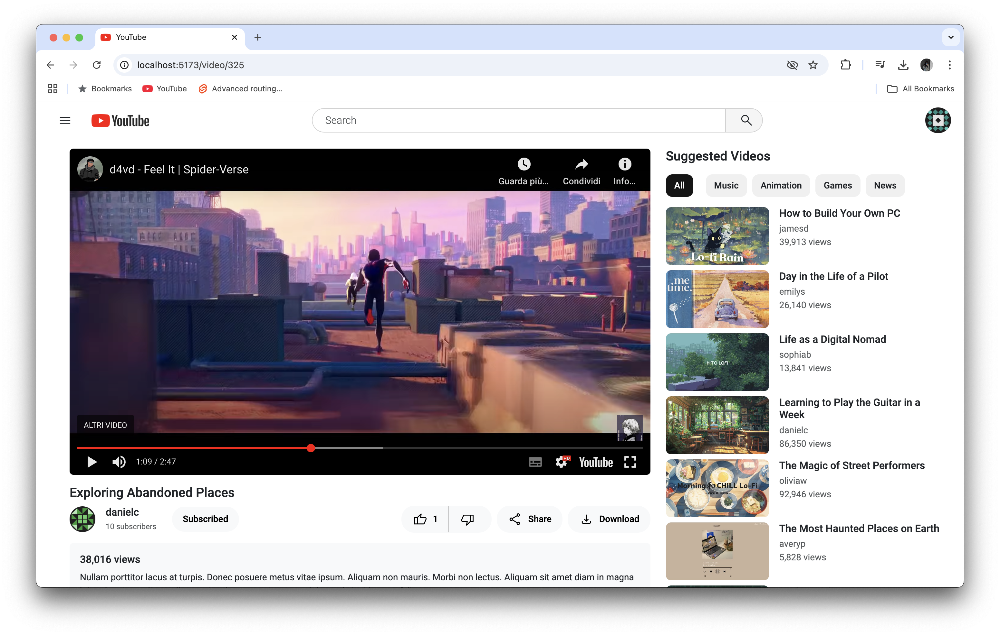
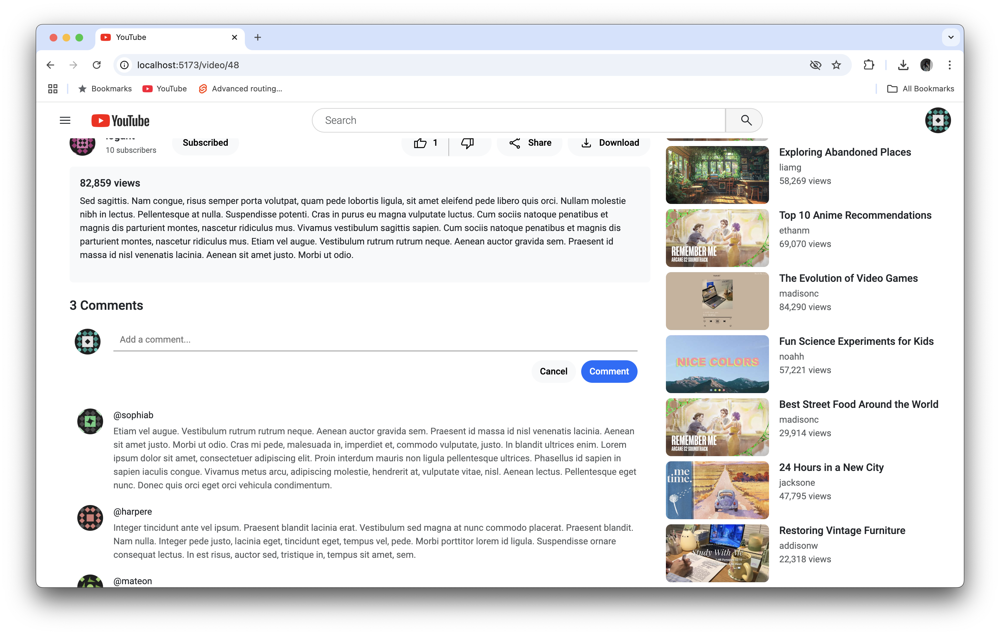

# YouTube-Clone

 

This is a simplified **YouTube clone** built with **SvelteKit**, **JavaScript**, and **Bootstrap**. It replicates key YouTube functionalities such as:
- 🎥 Video playback
- 📌 User subscriptions
- 👍 Likes
- 💬 Comments
- 🔑 Login
- 📋 Playlists

The app operates **without a backend database**, relying on **local storage** to save user data like subscriptions, liked videos, and comments. User profiles are dynamically fetched from the **DummyJSON** API, allowing users to log in with any credentials retrieved from `DummyJSON/users`.

Additionally, mock data used throughout the app is generated using **Mockaroo**, ensuring a realistic and diverse dataset for testing and functionality.

### 🎥 Video Playback 
In this project, the videos are embedded using **YouTube's iframe embed links**. The videos are **manually selected** from YouTube and then **shuffled** using **Mockaroo** to simulate a dynamic video experience. The application does not host videos but fetches them from YouTube, providing a smooth and real-world-like video playback experience.


## Installation
```bash
npm install
npm run dev
```

## Sceenshots




